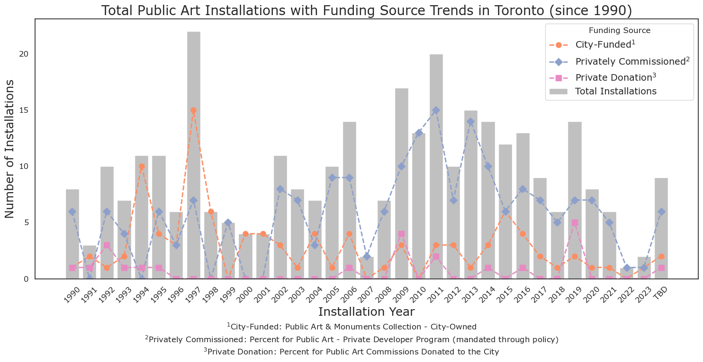

# Data Visualization

## Assignment 3: Final Project, 1st Visualization

For the first visualization of the final project, I used Python to demonstrate funding source trends in public art installations by year.

### Links

[City of Toronto Public Art Dataset](https://open.toronto.ca/dataset/public-art/)

### Files

[City of Toronto Public Art Dataset File](Public_Art_4326.csv)

[Python Notebook for Visualization](assignment_3_viz_1.ipynb)

### Total Public Art Installation in the City of Toronto and Trends of Funding Sources of the Installations (since 1990)

### Questions

- What software did you use to create your data visualization?

    > I used `Python` with libraries like `pandas` for data cleaning and `matplotlib` and `seaborn` for the visualization.

- Who is your intended audience? 

    > Toronto residents, city planners and arts administrators are the indended audience. The groups are directly involved in or affected by public art funding decisions. 
    
- What information or message are you trying to convey with your visualization? 

    > The goal is to show how different funding sources have contributed to the quantity and timeline of public art installations in Toronto. Visualizing trends by funding source over time gives us a glimpse of shift in public-private investments in the urban environment. For example, the visualization shows an increase in privately commisioned art installations. Given that commercial developments and new condos are encouraged through policy to provide public art avenues (Percent for Public Art Program, Policy 5: City of Toronto Official Plan, Section 3.1.2 Built Form, Subsection g), the rise in the privately commisioned art installations provides a subtle cue to the constant construction state of Toronto. 
    
- What aspects of design did you consider when making your visualization? How did you apply them? With what elements of your plots?

    > I focused on colour accessibility by using a colourblind-friendly palette, Seaborn's Colorbrewer Set2. I ensured clarity and readability through informative axis labels, titles and legends with adequate sized text using an AODA-compliant font (i.e., Verdana). I decided to combine shape and colour channels to show funding sources, which created both a more aesthetically pleasing look and ensured discriminability and separability. I limited the data to 1990 and onward, although the source starts from 1870, to minimize visual crowding and high cognitive load.
    
- How did you ensure that your data visualizations are reproducible? If the tool you used to make your data visualization is not reproducible, how will this impact your data visualization?

    > All steps from data cleaning to visualization were executed in a jupyter notebook using open-access data from the City of Toronto.
    
- How did you ensure that your data visualization is accessible?

    > I used a colourblind-friendly palette, provided clear labels, titles and legends with an AODA-compliant font. In addition, I provided a further information for the legend items in the caption.

- Who are the individuals and communities who might be impacted by your visualization? 

    > Artists and arts organizations involved in public art, city planners and city council members overseeing cultural invesment and funding and Toronto residents. 
    
- How did you choose which features of your chosen dataset to include or exclude from your visualization?

    > I chose to highlight "Source" (i.e., Funding Source), and "Installation Year" as they were the main focus to investigate funding dynamics over years. I excluded all other metadata (i.e., Artist, Ward, Title, Image links, Image Alt-text, Medium, Format, Orientation...) to minimize the cognitive load and ensure clarity.
    
- What ‘underwater labour’ contributed to your final data visualization product?
    
    > There were numerous date formatting problems I handled in data cleaning. Namely, the years were entered as string and art displays in progress had TBD tags in them. I wanted to include displays that were TBD. 

    > I needed to play around with different options of visualization -- I initially worked on stacked bar plots, but the trends in funding sources looked less clear. As a result, I opted for a bar plot showing the total number of installations overlayed with line plots for each funding source. Here, I needed to also test different colour schemes, markers and linestyles to ensure accessibility.

    > To understand what each funding source represent, I needed to do further reading on City of Toronto's policies and name the groupings accordingly. 