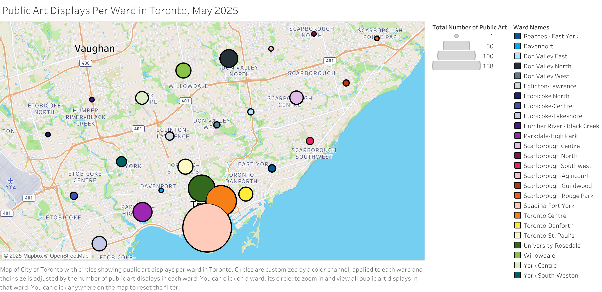
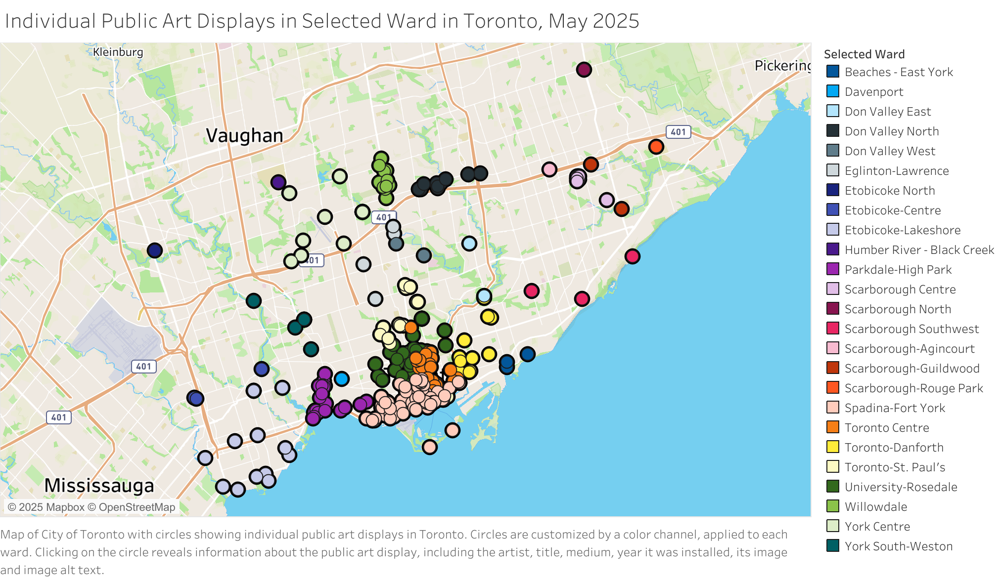
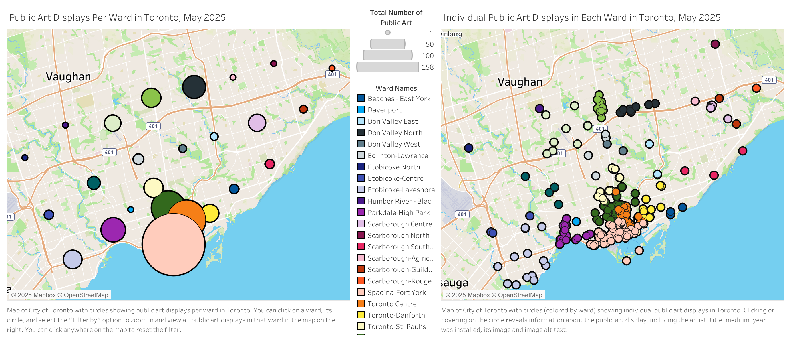
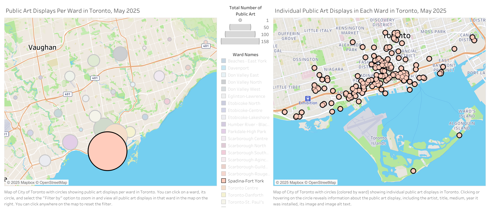
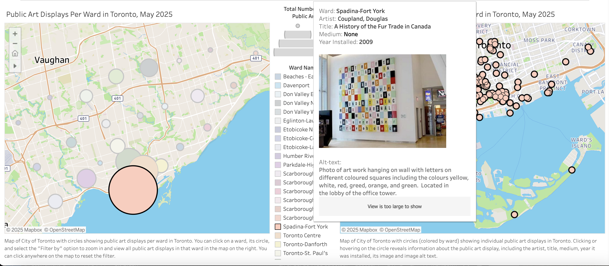

# Data Visualization

## Assignment 3: Final Project, 2nd Visualization

For the second visualization of the final project, I decided to use Tableau Public, a software with which I had zero prior experience. I wanted to visualize public art display concentrations in the 25 wards of Toronto and go even further by incorporating an interactive map with each art display.

### Links

[City of Toronto Public Art Dataset](https://open.toronto.ca/dataset/public-art/)

[Link to Tableau Public Viz](https://public.tableau.com/views/PublicArtDisplaysintheCityofToronto/Dashboard?:language=en-US&:sid=&:redirect=auth&:display_count=n&:origin=viz_share_link)

### Files

[City of Toronto Public Art Dataset File](Public_Art_4326.xlsx)

[Aggregated Data File](art_per_ward_data.xlsx)

[Tableau Workbook](Public_Art_Displays_in_the_City_of_Toronto.twbx)

### Public Art Displays Per Ward in Toronto (1)

### Individual Public Art Displays in Each Ward in Toronto (2)

### Interactive Dashboard, Example Images

Initial view

Filtered by Spadina-Fort York Ward

Looking into individual art displays

### Questions

- What software did you use to create your data visualization?

    > I used Tableau Public to create a geographic visualization of Toronto, showcasing the Public Art displays. Tableau Public does not require any code to generate maps, and to display Toronto, it appeared as the best option.

- Who is your intended audience? 

    > The visualization is designed for the public and urban design professionals interested in the spatial distribution of public art whether it reflects equitable cultural investment across neighbourhoods.
    
- What information or message are you trying to convey with your visualization? 

    > The visualization shows whether certain parts of Toronto have higher concentrations of public art. By comparing a sociodemographic map of Toronto ([example](https://www.toronto.ca/wp-content/uploads/2018/06/976e-ct16_TOR_Income_AfterTaxInc.pdf), more options available [here](https://www.toronto.ca/city-government/data-research-maps/neighbourhoods-communities/toronto-social-atlas/2016-maps/)), we can see whether the concentration of public art aligns with the demographic socioeconomic boundaries.
    
- What aspects of design did you consider when making your visualization? How did you apply them? With what elements of your plots?

    > I used circles as marks to represent each ward in the first visualization, where colour (to encode ward) and size (to encode the number of public art displays) as channels. The second visualization also used circles, as marks to represent each individual artwork and colour to encode each ward.

    > I wanted to follow the overview then zoom then details guideline of visualization from slide deck 4, slide 32. At an overview, viewerd see the overall concentration of public art displays in each ward. Filtering by ward shows the street-based density of public art displays. Clicking on each art display provides full information on the piece, including an image of it. 

    > Also, in the description on Tableau Public, I included a link to the dataset from City of Toronto to boost transparency and credibility. 
    
- How did you ensure that your data visualizations are reproducible? If the tool you used to make your data visualization is not reproducible, how will this impact your data visualization?

    > While Tableau dashboards are not directly reproducible, the workflow is documented in a workbook, and the final visualization is published online and accessible to others. I have also included a link to the dataset in the visualization description. Once I make the pull request, I will also incorporate my GitHub repo that has the datafiles and the Tableau Public workbook. Including the datafiles and the workbook ensures that the data visualization is reproducible.
    
- How did you ensure that your data visualization is accessible?

    > I included alt-text for all visualizations and incorporated the alt-text of each individual artwork from the dataset. In the captions, I included instructions on how to navigate the visualization. I also ensured labels are readable, tooltips are clear, and avoided red-green color pairs. Interactivity helps users explore without needing visual discrimination alone.  
    
- Who are the individuals and communities who might be impacted by your visualization?

    > Residents in underserved areas may notice gaps in public investment. Urban planners can use it for equitable decision-making. And also, artists may see trends in commissioned work by location.  
    
- How did you choose which features of your chosen dataset to include or exclude from your visualization?

    > To display Public Art Displays per Ward, I aggregated all _ids based on Ward Fullname. This enabled me to visualize the geographic concentrations of public art.

    > To display each individual art work, I used Latitude and Longitude (geometry in the original dataset) to map each art work, and included Ward name, Artist, Title, Year Installed, Medium, an Image of the art display and its alt-text. 
    
- What ‘underwater labour’ contributed to your final data visualization product?
    
    > First, I needed to figure out how to center each ward in Toronto on the map. I downloaded the City of Toronto's ward map, however, this included intricate coordinates to carefully specify each ward's border, a level of detail I did not need in my visualization. Instead, I opted to use the following link I found on Google to determine the centres of each ward: https://represent.opennorth.ca/boundaries/toronto-wards-2018/centroid?format=apibrowser.

    > In addition, I initially grouped the data, and the `art_per_ward_data.csv` document shows this. This allowed for me to input the counts and coordinates for each ward and create the first layer of the visualization. However, while I was doing this, I noticed that one of the art displays had the incorrect Ward code but the correct Ward name. I adjusted the aggregated Ward count to account for this.

    > For colour schemes, Tableau limits you to 20 colours, whereas Toronto has 25 wards. I needed to adjust the preferences code and add a new colour palette. I used the following link for colour codes: https://onenumber.biz/blog-1/2020/8/25/tableau-color-palettes-with-many-colors-40.

    > Overall, learning a new software and putting the map together was a really time-consuming project. I usually do my data visualizations in R, but the example visualizations we looked at for Assignment-2 inspired me to give this a go.